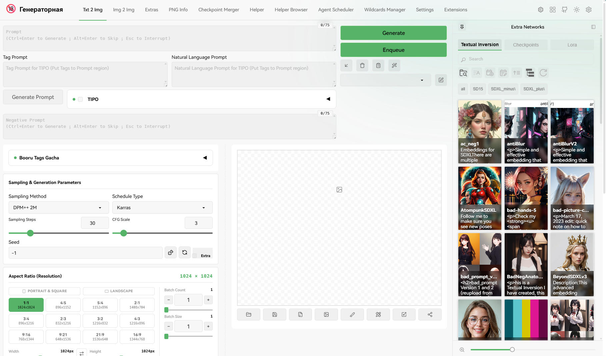

# 🎨 Lobe Theme Neo

<div align="center">

**Modern, Glassmorphism-inspired UI theme optimized for Stable Diffusion WebUI & Forge Neo (Gradio 4)**

[](https://github.com/LeonWGal/lobe-theme-neo/releases)
[](https://github.com/lobehub/sd-webui-lobe-theme)
[](https://github.com/Haoming02/sd-webui-forge-classic)
[](./LICENSE)
[](#-internationalization)
[](https://github.com/LeonWGal/lobe-theme-neo/pulls)

[English](./README.md) · [Русский](./README.ru-RU.md) · [简体中文](./README.zh-CN.md)

<br/>



</div>

---

## ✨ Features & Highlights

* 🌗 **Zero-Reload Dark / Light Switching**: Instant theme toggling via dynamic CSS classes and URL state synchronization (`history.replaceState`), eliminating Gradio hydration freezes.
* 🧩 **Full Forge Neo & Gradio 4 Compatibility**: Custom DOM handling and resilient selectors specifically engineered for Gradio 4 layouts and shadow DOM nodes.
* 📐 **SplitView (Two-Column Layout)**: Clean side-by-side workspace separating generation parameters from the preview gallery, with automated placement for `agent-scheduler-neo` Enqueue actions.
* 🎴 **Extra Networks Sidebar 2.0**: Dedicated collapsible drawer for LoRAs, Checkpoints, and Embeddings featuring real-time card resizing, instant search, and integrated Civitai Helper buttons.
* 🪄 **Prompt Studio & Formator**: One-click prompt beautifier, weight adjusters, syntax highlighting, and fast tag cleaners.
* 🛡️ **Companion Extension Support**: Out-of-the-box UI styling hooks for ADetailer Neo, TIPO, Booru Tags Gacha, Dynamic Prompts, Aspect Ratio Plus, and TagComplete.
* 🌐 **Built-in Multi-language (i18n)**: Comprehensive localization support for 11 languages (English, Русский, 简体中文, 繁體中文, 日本語, 한국어, Deutsch, Español, Français, Português, Turkish).

---

## 🏛 Architecture & Integration

`lobe-theme-neo` runs a lightweight React 18 / Ant Design presentation layer seamlessly mounted over Forge Neo / Gradio 4:

```
┌───────────────────────────────────────────────────────────┐
│                     Lobe Theme Neo                        │
├─────────────────────────────┬─────────────────────────────┤
│  Top Header (Nav + Actions) │  QuickSettings Sidebar      │
├─────────────────────────────┼─────────────────────────────┤
│  SplitView Workspace        │  Extra Networks Drawer      │
│  - Generation Controls (L)  │  - LoRA / Embeddings (R)    │
│  - Gallery Previewer (R)    │  - Civitai Metadata Inject  │
└─────────────────────────────┴─────────────────────────────┘
                              │ (Controlled DOM Injections)
                              ▼
┌───────────────────────────────────────────────────────────┐
│              Forge Neo / Gradio 4 Core Engine             │
└───────────────────────────────────────────────────────────┘
```

* **Controlled DOM Portals (`useInject`)**: Gradio DOM nodes are safely wrapped and moved without unmounting, ensuring native event listeners and component lifecycles remain 100% intact.
* **Resilient Mutation Observers**: Automatically detects asynchronous mounting of tabs, prompt textareas, and third-party extension accordions.
* **Dual-State Persistence**: Automatically synchronizes UI settings to browser `localStorage` (`SD-LOBE-SETTING`) and persists server-side in `lobe_theme_config.json` via `/lobe/config` endpoints.

---

## 📊 Compatibility Matrix

| Environment / Extension | Status | Details |
| :--- | :---: | :--- |
| **Forge Neo (Gradio 4.x)** | 🟢 Full | Native support for `#quicksettings`, dtype badges & memory settings |
| **SD WebUI (A1111 1.9+)** | 🟢 Full | Backward compatible fallback selectors for standard WebUI |
| **ADetailer Neo** | 🟢 Full | Styled accordion layout and container responsive fixes |
| **Agent Scheduler Neo** | 🟢 Full | Automated enqueue button routing in SplitView mode |
| **TagComplete (a1111-tac)** | 🟢 Full | Priority z-index hierarchy above `PromptHighlight` |
| **Civitai Helper** | 🟢 Full | Auto-injection of Civitai URLs, trigger words, and preview prompts |

---

## 🚀 Installation & Quick Start

### Method 1: WebUI Extensions Tab (Recommended)
1. Open your Forge Neo / WebUI interface.
2. Navigate to **Extensions** ➔ **Install from URL**.
3. Paste the repository URL:
   ```text
   https://github.com/LeonWGal/lobe-theme-neo.git
   ```
4. Click **Install**.
5. Switch to the **Installed** tab, click **Apply and restart UI**.

### Method 2: Git Clone
```bash
cd extensions
git clone https://github.com/LeonWGal/lobe-theme-neo.git
```

### Updating
```bash
cd extensions/lobe-theme-neo
git pull origin main
```

> [!IMPORTANT]
> To prevent CSS/JS conflicts, please disable any previous Lobe Theme or Kitchen Theme extensions before enabling `lobe-theme-neo`.

---

## ⚙️ Settings & Customization

Open the Settings modal via the ⚙️ icon in the top header:

| Group | Options |
| :--- | :--- |
| **🎨 Appearance** | Primary accent colors (14 presets), neutral grays, custom logo image & title, typography web-fonts, reduced animations. |
| **📐 Layout & SplitView** | Toggle side-by-side preview gallery, customize layout margins, show/hide footer. |
| **⬅️ QuickSettings Sidebar** | Docked (Fixed) vs Floating (Float) mode, default expanded state, configurable initial width. |
| **➡️ Extra Networks Sidebar** | Docked vs Floating mode, card grid size slider (64px - 256px), default tab selection. |
| **🪄 Prompt Textarea** | Scrollable vs Resizable mode, syntax highlighting, integrated Prompt Editor with TagList. |

---

## 🛠️ Development & Building

The source tree is powered by Vite, React 18, and TypeScript:

```bash
# 1. Install dependencies
npm install

# 2. Type-checking
npm run type-check

# 3. Build production bundle (outputs to javascript/main.mjs)
npm run build
```

---

## 💖 Acknowledgements & Upstream Credits

`lobe-theme-neo` is a modernized community continuation and Forge Neo port built upon the revolutionary work of the original **[sd-webui-lobe-theme](https://github.com/lobehub/sd-webui-lobe-theme)**.

* **Original Creator & Vision**: **[LobeHub](https://github.com/lobehub)** & **[CanisMinor](https://github.com/canisminor1990)** (`i@lobehub.com`).
* **Original Repository**: [lobehub/sd-webui-lobe-theme](https://github.com/lobehub/sd-webui-lobe-theme) — Sincere gratitude to LobeHub for crafting the `@lobehub/ui` design system and setting new standards for AI web interfaces.
* **Forge Neo Adaptation & Maintenance**: [LeonWGal](https://github.com/LeonWGal) (Gradio 4 reactivity, SplitView placement, DOM fixes, and companion extension integrations).

---

## 📄 License

Distributed under the [AGPL-3.0 License](./LICENSE) in accordance with the upstream LobeHub project.
